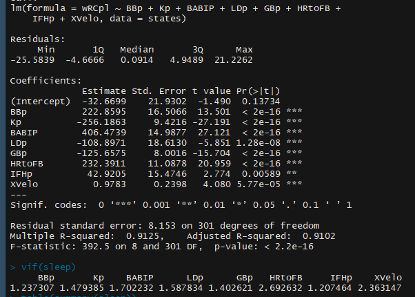

```{r setup, include=FALSE}
library(data.table)
library(ggplot2)
library(car)
knitr::opts_chunk$set(echo = FALSE)
Data = na.exclude(fread('c:/users/owner/desktop/scrapyproject/fangraphs/xvelo_3.csv', integer64 = 'numeric'))
```

# Exit Velocity


## Overview

 - Exit Velocity is the speed of a baseball leaving the bat
 
 - EV has only been captured since 2015
 ```{r  eval=TRUE}
HRFB = Data[,c('Year','HRtoFB','XVelo')]
ggplot(HRFB, aes(x=XVelo, y=HRtoFB)) +
    geom_point(aes(colour=factor(Year))) +
    geom_smooth(method="lm", level=0.90) + xlab("Exit Velocity (MPH)") + ylab("Home Run to Fly Ball ratio")
```

## Scraping
 
 - Exit Velocity data from baseballsavant.mlb.com
 - All other data from www.fangraphs.com
 - Scrapy Recursion allows an item to be created from multiple Requests:

			item['wRAA'] = wRAA
			item['wOBA'] = wOBA
			item['wRCpl'] = wRCpl

			yield Request(response.url.split(sep='type=1')[0] + 'type=2' + response.url.split(sep='type=1')[1], 
				callback=self.parse_batted, meta={'item': item, 'Name': Name, 'Year': Year}, 
				dont_filter=True)


	def parse_batted(self, response):
		item = response.meta['item']
...


 
## ISO

- Isolated Power metric (SLG-OBP)

 ```{r  eval=TRUE}
ISO = Data[,c('Year','ISO','XVelo')]
ggplot(ISO, aes(x=XVelo, y=ISO)) +
    geom_point(aes(colour=factor(Year))) +
    geom_smooth(method="lm", level=0.95) + xlab("Exit Velocity (MPH)") + ylab("ISO")
```

## wRC+
weighted Runs Created Plus is a composite rate stat designed to capture comprehensive offensive value.

- Adjusts for Park Factors
- Scaled to League Mean for a given year.
- A wRC+ of 165 can be read as "The Player generated 65% more runs than the league average for the year"


## wRC+
 ```{r  eval=TRUE}
RC = Data[,c('Year','wRCpl','XVelo')]
ggplot(RC, aes(x=XVelo, y=wRCpl)) +
    geom_point(aes(colour=factor(Year))) +
    geom_smooth(method="lm", level=0.95) + xlab("Exit Velocity (MPH)") + ylab("wRC+")
cor(RC$XVelo, RC$wRCpl)
```


## Multiple Linear Regression

Stepwise BIC Model:



## Next Steps

- Launch Angle

- Granularity

- Trend Analysis